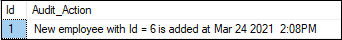

A trigger is a set of SQL statements that reside in system memory with unique names. It is a specialized category of stored procedure that is called automatically when a database server event occurs. Each trigger is always associated with a table.

A trigger is called a special procedure because it cannot be called directly like a stored procedure. The key distinction between the trigger and procedure is that a trigger is called automatically when a data modification event occurs against a table. A stored procedure, on the other hand, must be invoked directly.

The following are the main characteristics that distinguish triggers from stored procedures:

We cannot manually execute/invoked triggers.
Triggers have no chance of receiving parameters.
A transaction cannot be committed or rolled back inside a trigger.

Example of Trigger in SQL Server
Let us understand how we can work with triggers in the SQL Server. We can do this by first creating a table named 'Employee' using the below statements:

CREATE TABLE Employee  
(  
  Id INT PRIMARY KEY,  
  Name VARCHAR(45),  
  Salary INT,  
  Gender VARCHAR(12),  
  DepartmentId INT  
)  
Next, we will insert some record into this table as follows:

INSERT INTO Employee VALUES (1,'Steffan', 82000, 'Male', 3),  
(2,'Amelie', 52000, 'Female', 2),  
(3,'Antonio', 25000, 'male', 1),  
(4,'Marco', 47000, 'Male', 2),  
(5,'Eliana', 46000, 'Female', 3)  
We can verify the insert operation by using the SELECT statement. We will get the below output:

SELECT * FROM Employee;  

Triggers in SQL Server
We will also create another table named 'Employee_Audit_Test' to automatically store transaction records of each operation, such as INSERT, UPDATE, or DELETE on the Employee table:

CREATE TABLE Employee_Audit_Test  
(    
Id int IDENTITY,   
Audit_Action text   
)  
Now, we will create a trigger that stores transaction records of each insert operation on the Employee table into the Employee_Audit_Test table. Here we are going to create the insert trigger using the below statement:

CREATE TRIGGER trInsertEmployee   
ON Employee  
FOR INSERT  
AS  
BEGIN  
  Declare @Id int  
  SELECT @Id = Id from inserted  
  INSERT INTO Employee_Audit_Test  
  VALUES ('New employee with Id = ' + CAST(@Id AS VARCHAR(10)) + ' is added at ' + CAST(Getdate() AS VARCHAR(22)))  
END  
After creating a trigger, we will try to add the following record into the table:

INSERT INTO Employee VALUES (6,'Peter', 62000, 'Male', 3)  
If no error is found, execute the SELECT statement to check the audit records. We will get the output as follows:

Triggers in SQL Server